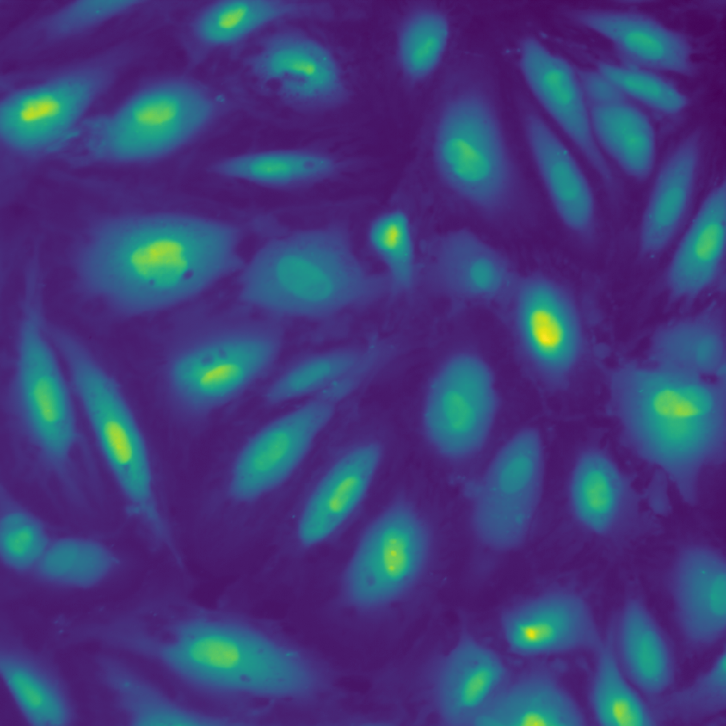

# Analysis of calcium imaging

In this problem, we will practice a number of common methodologies for the analysis of images and calcium traces based on videos. Differently to the other projects proposed in this Hackathon, this project is more educational and aims at giving hands-on practice with Python and Jupyter Notebooks. Using videos of fluorescent calcium-indicator Oregon Green in endothelial cells, we will practice:

1. a simple method to segment cells;
2. extract fluorescence time series of a set of cells;
3. and estimate their calcium concentration and other population statistics.

As extra activities, participants may also use this dataset to learn how to automate pipelines for image processing and create videos such as [this one](https://static-content.springer.com/esm/art%3A10.1038%2Fs41467-017-01741-8/MediaObjects/41467_2017_1741_MOESM4_ESM.mp4) using a few lines of code in Python.


The dataset used in this problem was kindly provided by [Dr. Julia Mack](https://www.linkedin.com/in/julia-mack-0790a52/) from the [Arispe Lab](https://arispelab.mcdb.ucla.edu/), and was used in [their recent publication on Nature Communications](https://www.nature.com/articles/s41467-017-01741-8).

### Primary goal

From the discussions in the Hackathon, we will publish a notebook which will provide an example of how to extract and analyse calcium dynamics form a video. This notebook will be available publicly to everyone, and other people from the QCBio community will be able to use it as an additional resource for this kind of analysis.


### Technical challenges

* Handling images and videos with python

* Dealing with photobleaching and estimating calcium concentration

* Applying regression on a set of time series

* Extracting statistics based on a set of cells

* [extra] Automating a pipeline using parallel processing

* [extra] Creating animations based on data


<br />

## Problem 1 - Segmenting and separating cells

#### Guideline

0. The data is provided here. It consists of h5files that contain four samples. Start by downloading the file ```Notch1KD_JMackNatComm2017_samples.hdf5```.

1. Import the h5 file into your Python environment (*hint:* h5py). You should have access to 4 samples, called ```sample1```, ```sample2```, ```sample3``` and ```sample4```. Each sample is a 1024x1024 video of 600 seconds. Choose one of them and use this sample to figure out how to identify and index the cells, then apply your solution to the other files.

2. Plot a few frames of your video. Using shape
    * *Optional:* Often the file you have access to is not in a video format. Create a video of it using this script.
    * *Optional:* Add comment lines to the script, explaining what each line does.
This is how they should look like:
<div style="text-align:center"></div>


3. Find the average fluorescence of the whole video as a function of time. Plot it and interpret what is happening.

4. Use operations from libraries [scikit-image](http://scikit-image.org/) and [OpenCV](https://opencv-python-tutroals.readthedocs.io/en/latest/index.html) to separate each cell. There are many ways to do it, the easiest way is to identify the region around each nucleus and use it to segment the image. We share below the steps to achieve that.

    * Select specific frames an try some filters on it. For instance, try using a median blur and thresholding it. Use this first step to get some feeling of how these tools affect the images.

    * Use filters and thresholds to turn the regions close to each of the nuclei into "blobs" (see example below).

    * Use blob detection techniques. *Hint:* Take a look at scikit-image's ```measure.label()``` function.

    * Post-process your results.

5. You should now have set of subregions of your image where you can find each cell. Write a small code that, given the ID of a cell, it plots the average fluorescence in the corresponding region as a function of time.

6. Export your results using NumPy's ```savetxt()``` function. We recommend that you use an array of shape ```(Ncells,600)```, where Ncells represents the number of cells found by your code.

7. *Optional*: On top of a plot with one of your frames, use matplotlib's ```text()``` function to show what is the id of each of your cells (see below an example).


### Resources

* For blob detection:
  * [Blob detection on Learn OpenCV](https://www.learnopencv.com/blob-detection-using-opencv-python-c/), Satya Mallick's website dedicated to sharing ideas and tutorials on computer vision.
  * Scikit-image's [page on blob detection](http://scikit-image.org/docs/dev/auto_examples/features_detection/plot_blob.html)
  * [Here's an example](https://www.youtube.com/watch?v=4DynOyNN_FI&t=2s) of what you can accomplish with such techniques.


## Problem 2 - Removing photobleaching and estimating calcium concentration

#### Guideline

1.


## Extra Problem 1 - Automate the pipeline

#### Guideline

1.


## Extra Problem 2 - create a video!

#### Guideline

1. Learn how to use Matplotlib's animate function.
