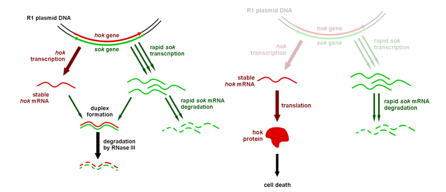

# Simulating the Hok/Sok genetic mechanism with the Gillespie algorithm

The Hok/Sok system is an important duo of proteins that can be used as kill switch in synthetic biology. In this project, we will create a model that predicts expression levels of Hok/Sok and implement the Gillespie algorithm, a Kinetic Monte Carlo method that efficiently simulates stochastic processes in continuous time.

### Primary goal

By the end of the Hackathon, you should have your own implementation of the Gillespie algorithm to simulate gene expression as a function of a few rate parameters.

### Technical challenges

* Create a model that represents a real biological system.

* Learn how to implement the Gillespie algorithm

* Determine the parameters for the simulation

### Guideline

1. Start by going through [this Jupyter Notebook](./GillespieProject.ipynb) ([click here to download it](./Gillespie.zip)). This notebook will help you familiarize with random numbers in Python. It also provides hints on how the Gillespie method works.  Once you have finished going through this notebook, you will be ready to begin this project.

2. You can first propose a model on a paper sheet that describes the Hok/Sok system (you can begin with the case where there is the plasmid). List the number of entities you want to simulate, as well as the possible events that might affect these entities.

3. Using what has been done in the Notebook, implement a function that will simulate your model.

4. Try to fit your parameters with the information provided in the [ressources below](./Readme.md#resources).

5. Let's consider that the plasmid disappear. Can you imagine a simulation that will represent this event?

### Resources

* A good start is the [Wikipedia page on the Gillespie Algorithm](https://en.wikipedia.org/wiki/Gillespie_algorithm).

* Thisted, Thomas, and Kenn Gerdes. "Mechanism of post-segregational killing by the hok/sok system of plasmid R1: Sok antisense RNA regulates hok gene expression indirectly through the overlapping mok gene." Journal of molecular biology 223.1 (1992): 41-54.

* Gillespie, D.T. (1977). Exact stochastic simulation of coupled chemical reactions. J. Phys. Chem. 81, 2340–2361.

* Paulsson, J. (2005). Models of stochastic gene expression. Physics of Life Reviews 2, 157–175.

### Applications of the Gillespie algorithm:

* Dessalles, R., Fromion, V., and Robert, P. (2017a). A stochastic analysis of autoregulation of gene expression. J. Math. Biol. 1–31.

* Dessalles, R., Fromion, V., and Robert, P. (2017b). Models of protein production with cell cycle. ArXiv:1711.06378 [q-Bio].

* An [iGEM project](http://2015.igem.org/Team:Brasil-USP/Modeling/GeneExpression) that used Hok/Sok as kill switch for to control bio-engineered cells capable of degrading rubber.
