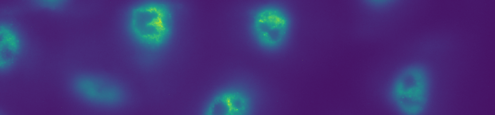

# Processing a batch of very large images

One common solution to process a batch of data (e.g. images, sequencing reads, etc) is to paralelize your pipeline and make use of multiple CPUs. There usually are multiple ways to paralelize a pipeline, and some details may depend on the specifications of your project. In this practice, we will paralelize a simple pipeline that processes a single-molecule [FISH](https://en.wikipedia.org/wiki/Fluorescence_in_situ_hybridization) dataset. The main goal is to identify candidate mRNA as diffraction limited spots in images.

The dataset used in this problem was kindly provided by [Rob Foreman](https://github.com/rfor10) from the [Wollman Lab](http://wollman.chem.ucla.edu/).

### Primary goal

Implement a script that automates the processing of a large batch of images using all resources available. The emphasis of this project is on best practices for parallel processing and mamory management in python.

### Technical challenges

* Basics of parallel processing in Python

* Automating the analysis of batches of large images

* Good practices for a memory efficient implementation of parallel processing in Python

### Dataset

You can find the dataset for this problem [here](./Dataset.md).

### Guideline

* To be announced

### Resources

* This problem is related to [this ongoing project](https://github.com/rfor10/spot_calling), which is developing a methodology to find and classify diffraction limited single-molecule FISH spots.
